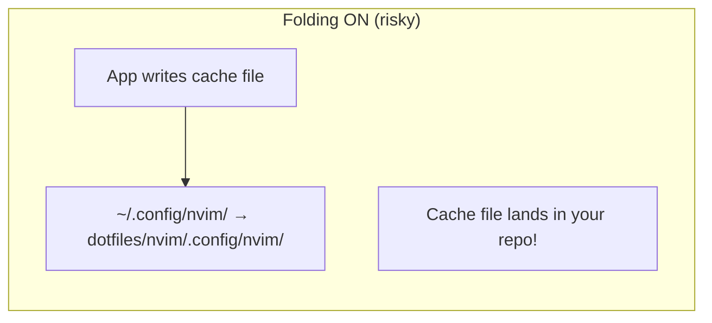
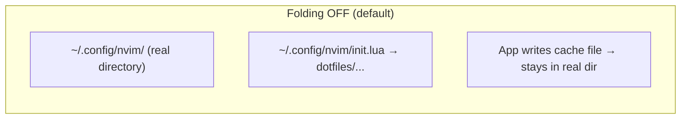
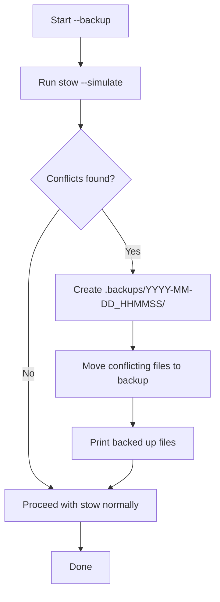
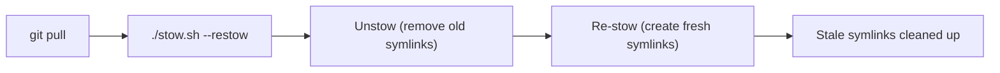
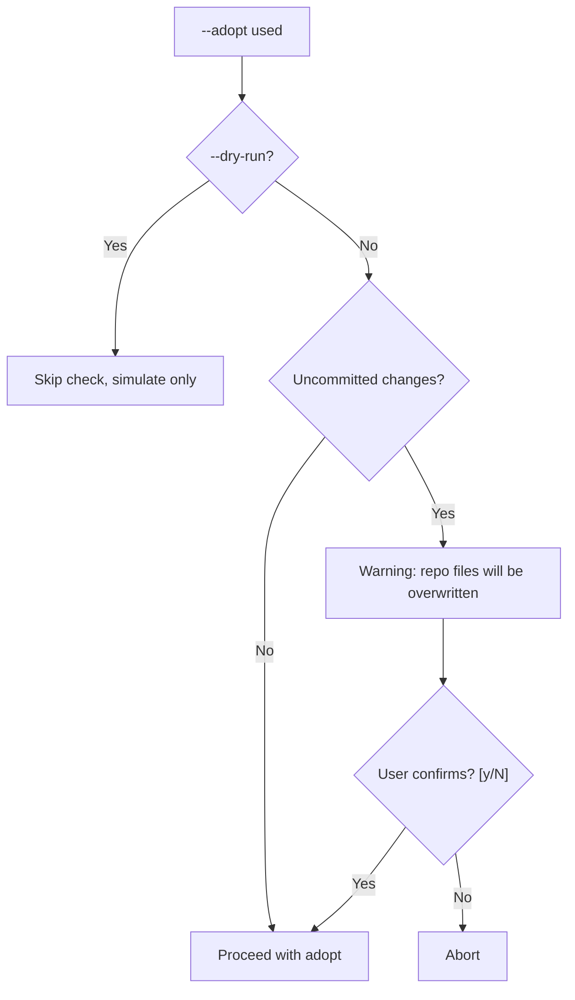
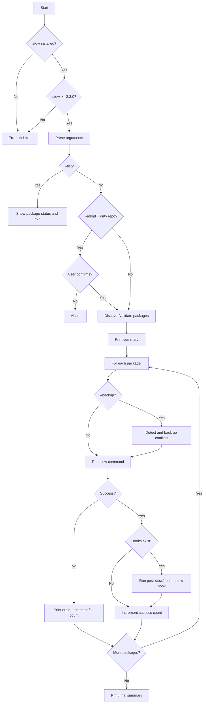

# stow.sh - Detailed Documentation

This document covers the `stow.sh` wrapper script in detail: how it works, all available options, and troubleshooting tips.

---

## How GNU Stow Works

[GNU Stow](https://www.gnu.org/software/stow/manual/stow.html) is a symlink farm manager. It takes files from a **package directory** and creates symbolic links in a **target directory** (by default `$HOME`), mirroring the directory structure.

### Package to symlink mapping

Each top-level directory in this repository is a stow package. The internal structure determines where symlinks appear:

```
dotfiles/                          $HOME/
├── bash/
│   └── .bashrc             →      ~/.bashrc
├── nvim/
│   └── .config/nvim/
│       ├── init.lua        →      ~/.config/nvim/init.lua
│       └── lua/
│           └── plugins/
│               └── lsp.lua →      ~/.config/nvim/lua/plugins/lsp.lua
└── git/
    └── .gitconfig          →      ~/.gitconfig
```

The arrow (`→`) represents a symbolic link. The actual file lives in the dotfiles repository; `$HOME` only contains symlinks pointing back to it.

---

## Quick Start

```bash
git clone https://github.com/mmmarceleza/dotfiles.git
cd dotfiles
./stow.sh              # Stow all packages
./stow.sh --list       # Check what got linked
```

---

## Options Reference

| Option        | Description                                                                 |
|---------------|-----------------------------------------------------------------------------|
| `--uninstall` | Remove symlinks (unstow) instead of creating them                          |
| `--restow`    | Unstow then re-stow packages, cleaning up stale symlinks                   |
| `--dry-run`   | Simulate all actions using stow's `--simulate` flag (no changes made)      |
| `--verbose`   | Show detailed output from stow for each operation                          |
| `--adopt`     | Move existing files from `$HOME` into the package, then create symlinks    |
| `--backup`    | Automatically back up conflicting files before stowing                     |
| `--folding`   | Allow stow to symlink entire directories (disabled by default)             |
| `--list`      | Display all packages with their stow status (`stowed`/`partial`/`not stowed`) |
| `--help`      | Show usage information and exit                                            |

Options can be combined:

```bash
./stow.sh --backup --verbose bash nvim    # Back up conflicts, verbose stow
./stow.sh --dry-run --verbose             # See what would happen for all packages
./stow.sh --restow --verbose bash         # Re-stow bash with verbose output
```

---

## Features in Detail

### Auto-discovery

When no packages are specified, `stow.sh` discovers all top-level directories in the repository and stows them. The following directories are excluded:

| Ignored directory | Reason                          |
|-------------------|---------------------------------|
| `.git`            | Git repository metadata         |
| `.github`         | GitHub workflows and configs    |
| `.claude`         | Claude Code configuration       |
| `docs`            | Documentation files             |

### No-folding (default behavior)

By default, `stow.sh` passes `--no-folding` to stow. This means stow creates symlinks for **individual files** rather than symlinking entire directories.

**Why this matters:**





With folding, applications that write to config directories (cache files, history, plugin data) would pollute your dotfiles repository. For example, Vim writing `.vim/netrwhist` into a symlinked directory means that file ends up tracked by git.

Use `--folding` only if you explicitly want directory-level symlinks for a specific reason.

### Conflict Backup (`--backup`)

When stowing a package, existing files in `$HOME` that conflict with the symlinks will cause stow to fail. The `--backup` flag detects these conflicts and moves them to a backup directory before stowing.



**Example:**

```bash
# You have an existing ~/.bashrc (not a symlink)
$ ./stow.sh --backup bash
Processing: bash
Backing up conflicting files to .backups/2026-03-01_143022
  .bashrc
Done. 1 package(s) linked successfully.

# Original file preserved:
$ cat .backups/2026-03-01_143022/.bashrc
```

Backups are stored in `.backups/` (gitignored) inside the dotfiles directory. The `--backup` flag only applies to the `--stow` action and is skipped during `--dry-run`.

### Restow (`--restow`)

Stow's restow mode (`-R`) unstows and then re-stows packages. This is useful after pulling changes from git, because:

- New files added to a package need to be symlinked
- Files removed from a package leave behind stale symlinks



```bash
git pull                    # Pull latest dotfiles changes
./stow.sh --restow         # Clean up and re-link everything
```

### Adopt Mode (`--adopt`)

The `--adopt` flag tells stow to **move existing files from `$HOME` into the package directory**, then create symlinks. This is useful for importing configs that already exist on your system into the dotfiles repo.

**Safety warning:** since `--adopt` overwrites files in the repository, the script checks for uncommitted changes and prompts for confirmation:



```bash
# Import an existing config into the repo
./stow.sh --adopt nvim

# Recommended workflow: commit first, then adopt, then diff
git add -A && git commit -m "checkpoint before adopt"
./stow.sh --adopt nvim
git diff   # Review what changed
```

### Hooks (`.stow-hooks/`)

Packages can include hook scripts that run automatically after stowing or unstowing. Place executable scripts inside a `.stow-hooks/` directory within the package:

```
nvim/
├── .config/nvim/
│   └── init.lua
└── .stow-hooks/
    └── post-stow       # Runs after stowing nvim
```

**Supported hooks:**

| Hook           | When it runs                                      |
|----------------|---------------------------------------------------|
| `post-stow`    | After a successful `--stow` or `--restow` action |
| `post-unstow`  | After a successful `--uninstall` action           |

**Rules:**
- Hook scripts must be **executable** (`chmod +x`)
- Hooks are **skipped** during `--dry-run`
- A failing hook prints a warning but does **not** abort the script
- The `.stow-hooks/` directory is automatically ignored by stow (not symlinked to `$HOME`)

**Example hook** (`bat/.stow-hooks/post-stow`):

```bash
#!/bin/bash
# Rebuild bat's syntax/theme cache after config changes
bat cache --build
```

**Example hook** (`fonts/.stow-hooks/post-stow`):

```bash
#!/bin/bash
# Rebuild font cache after installing new fonts
fc-cache -fv
```

### Package Status (`--list`)

The `--list` flag shows all available packages and whether they are currently stowed:

```
$ ./stow.sh --list
  [stowed]      bash
  [partial]     bin
  [stowed]      git
  [not stowed]  nvim
  [stowed]      zsh
```

| Status        | Meaning                                                     |
|---------------|-------------------------------------------------------------|
| `[stowed]`    | All files in the package have corresponding symlinks in `$HOME` |
| `[partial]`   | Some files are symlinked, others are not                    |
| `[not stowed]`| No symlinks from this package exist in `$HOME`              |

Status is determined by scanning actual symlinks, not by a state file. This means it always reflects reality.

---

## Script Flow

The overall execution flow of `stow.sh`:



---

## Troubleshooting

### "existing target is neither a link nor a directory"

**Cause:** A real file already exists in `$HOME` where stow wants to create a symlink.

**Solution:** Use `--backup` to automatically back up the conflicting file:

```bash
./stow.sh --backup <package>
```

Or manually move the file before stowing:

```bash
mv ~/.bashrc ~/.bashrc.bak
./stow.sh bash
```

### "stow >= 2.3.0 required"

**Cause:** Your installed version of stow is too old. The `--no-folding` flag requires version 2.3.0 or later.

**Solution:** Update stow via your package manager:

```bash
# Arch Linux
sudo pacman -S stow

# Ubuntu/Debian
sudo apt install stow

# macOS
brew install stow
```

### Stale symlinks after removing files from a package

**Cause:** You deleted a file from a package directory and ran `./stow.sh`, but the old symlink in `$HOME` still exists.

**Solution:** Use `--restow` to clean up:

```bash
./stow.sh --restow <package>
```

### Hook not running

Check that:
1. The hook script is **executable**: `chmod +x <package>/.stow-hooks/post-stow`
2. The hook has a proper **shebang** line: `#!/bin/bash`
3. You are **not** using `--dry-run` (hooks are skipped in dry-run mode)

---

## Package Structure Reference

A complete package with all features looks like this:

```
my-package/
├── .config/
│   └── my-app/
│       ├── config.toml        → ~/.config/my-app/config.toml
│       └── themes/
│           └── dark.toml      → ~/.config/my-app/themes/dark.toml
├── .local/
│   └── bin/
│       └── my-script          → ~/.local/bin/my-script
└── .stow-hooks/
    ├── post-stow              # Runs after stowing (not symlinked)
    └── post-unstow            # Runs after unstowing (not symlinked)
```

The `.stow-hooks/` directory is never symlinked into `$HOME`. Only the configuration files inside the package are managed by stow.
